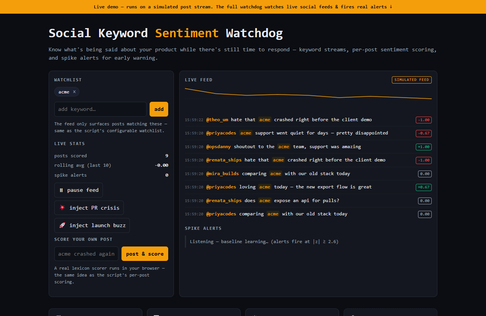

# Social Keyword Sentiment Watchdog — live demo

  

  <a href="https://amos-mig.github.io/twitter-keyword-sentiment-watchdog-demo/"><strong>▶ Open the live demo</strong></a> ·
  <a href="https://amosmign.gumroad.com/l/twitter-keyword-sentiment-watchdog"><strong>Get the full product · €29</strong></a>

## What this is

An in-browser simulation of the Social Keyword Sentiment Watchdog: configure a keyword watchlist and watch a simulated social stream get scored in real time by a lexicon-based sentiment engine, with a live rolling-average chart and z-score spike detection firing early-warning alerts. Locked cards and a clearly-labeled simulated feed mark what only the full Python product adds (live sources, webhook delivery, daily digests).

**Try it:** Add your own keyword, click 'inject PR crisis', and watch the negative-spike alert fire within seconds — or type a post yourself to see it scored live.

## What you get in the full product

- Keyword streams with configurable watchlists
- Sentiment scoring per post and rolling averages
- Spike detection for early-warning alerts
- Daily digest output for quiet days
- Single Python file, adaptable to any data source

## About

- **Storefront:** [kits.amosmignery.dev](https://kits.amosmignery.dev) — single-file products, instant download, commercial license
- **Checkout:** [Gumroad](https://amosmign.gumroad.com/l/twitter-keyword-sentiment-watchdog) (Merchant of Record, VAT handled)
- **Full product:** [Social Keyword Sentiment Watchdog](https://amosmign.gumroad.com/l/twitter-keyword-sentiment-watchdog) · €29

## License

The demo page in this repo is MIT-licensed — reuse the technique, not the product.
The **Social Keyword Sentiment Watchdog** itself is not included here and is not free software.
